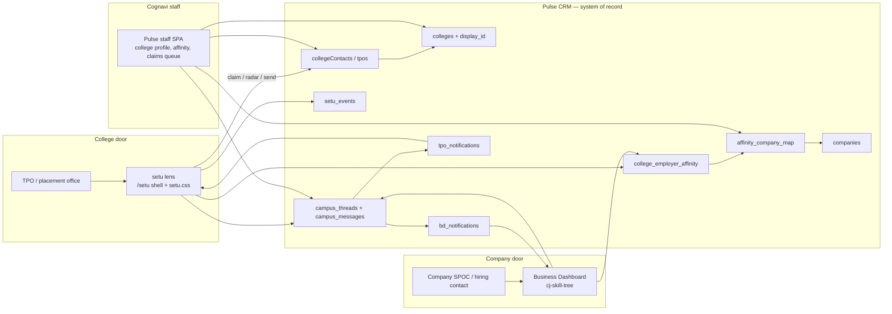
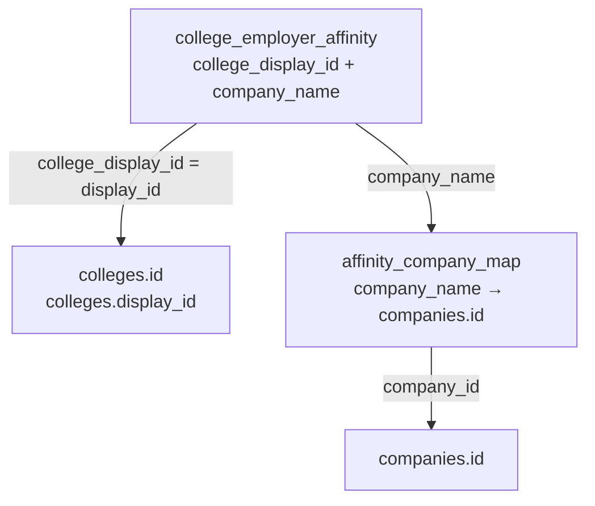

# setu on Pulse — TPO lens, company awareness, and Pulse-controlled identity

| Field | Value |
|---|---|
| **Title** | setu on Pulse — TPO lens, company awareness, and Pulse-controlled identity |
| **Author** | TBD (Cognavi India / Pulse) |
| **Date** | 2026-08-31 |
| **Status** | Approved |
| **Audience** | Pulse + setu engineers; Cognavi India leadership |
| **Repos** | `cognavi-team-pulse` (system of record), `pulse-campus` (TPO first-session prototype) |
| **Visual** | [`pulse-campus/docs/superpowers/setu-pulse-relationship.html`](../setu-pulse-relationship.html) |

---

## Overview

setu ("bridge") is the college-facing product for placement offices. Pulse CRM already holds colleges, companies, university contacts, College Affinity, TPO portal auth, and both notification feeds. setu must **not** become a second database.

This design puts setu on Pulse as the **TPO-facing lens** of one deployable app. Public landing and the authenticated radar live at `/setu` (own shell, own stylesheet). The existing University OS stays at `/tpo-portal` (default tab `overview`). The company-facing lens is the Business Dashboard in **`cj-skill-tree`** (separate repo, contract-tested via `tests/unit/skill-tree-contract.test.ts`). The shared graph both sides read is College Affinity (`college_employer_affinity`, `/outreach/affinity`).

The alumni–employer graph is **not missing**. It already lives in Pulse College Affinity. The work is identity, canonical joins, messaging objects, and a TPO-safe read of that graph — not a new CRM.

---

## Background & Motivation

### Current state

Pulse is a single Express + React SPA (`cognavi-team-pulse`) with three relevant doors:

| Door | Who | Auth | Home |
|---|---|---|---|
| Pulse staff | Cognavi | staff JWT | `/outreach/affinity`, college profile, university workbench |
| TPO portal | Placement office | `tpo_pulse_token` cookie (`server/tpo-auth.ts`) | `/tpo-portal` |
| Business Dashboard (`cj-skill-tree`) | Company SPOC | skill-tree cookie (`/api/skill-tree/*`) | BD notifications + roles (separate deploy) |

College Affinity is already a two-direction, one-dataset dashboard (`client/src/pages/outreach-affinity.tsx`):

- **PE mode** — company → colleges (`GET /api/outreach/affinity/company?name=`)
- **PU mode** — college → companies (`GET /api/outreach/affinity/college?displayId=`)

Data is Coresignal CD-123 aggregated public-profile counts, loaded out-of-band (migration `0095_college_employer_affinity.sql`). Every response carries `AFFINITY_DISCLAIMER`. Permission: `outreach.affinity`.

The TPO portal is a college-scoped University OS: roster, opportunities (`jd_college_targets` + `tpo_notifications` type `new_opportunity`), internal jobs, referrals (`tpo_referrals`), and staff-reviewed college edits (`college_data_submissions`). Identity is a row in `tpos` (`collegeContacts` in `shared/schema.ts`). Login (`POST /api/tpo-auth/login`) **already requires** `portalEnabled`. Staff enable access from the college profile via `POST /api/tpos/:id/enable-portal`.

setu exists today as a high-fidelity TPO prototype in `pulse-campus`: light-first `index.html`, dark at `dark.html`, session in `localStorage` key `pulse-campus:dc:v3`. The loop is claim campus → radar of employers → evidence (hiring teams, coordinated hellos, where they studied) → reviewed send → inbox. Counts are honest; names exist only for people on Pulse who reply; LinkedIn is source-only; nothing sends without an explicit click.

### Pain points

1. **Prototype is a second store.** `pulse-campus:dc:v3` cannot be the system of record. Claimed offices, inbox threads, and reveals would drift from Pulse the moment a second campus uses it.
2. **TPO portal does not show the affinity graph.** `GET /api/tpo-portal/companies` returns only *engaged* companies (`getEngagedCompaniesForCollege` joins `engagements` where `status = 'active'`). The employers a campus actually cares about — alumni destinations — live in `college_employer_affinity` and are visible only to staff with `outreach.affinity`.
3. **Affinity is weakly keyed on the company side.** Rows are `(college_display_id, company_name)` where `company_name` is a canonical brand, not `companies.id`. The PU view already does a best-effort `lower(companies.name) = lower(a.company_name)` lateral join for logos. That is not enough to address a `bd_notifications` row or open a thread.
4. **Companies are not aware of campuses (and vice versa) except through staff.** BD has a generic notification feed (`bd_notifications`, types like `candidates_shared`) and a sanitized college list (`GET /api/skill-tree/colleges`). There is no campus→company hello, no feeder-college view in BD, and no TPO inbox for a company reply.
5. **Claim is simulated.** Prototype work-email checks are client-side. Pulse already has `emailStatus` (`valid | invalid | needs_validation`) on `collegeContacts` and a staff enable-portal path. setu must reuse them.

### Product intent (locked)

- Pulse remains the only master for university contacts, college IDs, companies, students, JDs, and approvals.
- setu is a lens, not a CRM.
- Companies must become aware of colleges, and colleges of companies.
- Future: notifications both ways when a campus messages a company and when a company replies.
- Honesty / DPDP: counts from public profiles; names only for people on Pulse who reply; LinkedIn is a job-source tag; no invented PII.

---

## Goals & Non-Goals

### Goals

1. Ship setu as a TPO lens **inside the Pulse SPA** (one deployable app, separate `/setu` shell — C-prime). Do not steal `/tpo-portal`’s default tab.
2. Reuse `collegeContacts` (`tpos`) + `emailStatus` + `portalEnabled` for claim and graph unlock. Public claim is **insert-only**. No setu-only identity table.
3. Radar and “where they studied” **read** `college_employer_affinity`. Treat people counts as directional intelligence, never verified headcount.
4. Canonicalize `companyName` → `companies.id` so a reviewed send can address a real Pulse company. Unmatched brands stay counts-only.
5. Design the messaging objects now: a Pulse thread (campus office ↔ company), `bd_notifications.type = campus_hello`, extended `tpo_notifications` types. No auto-send.
6. Instrument a Pulse-sourced north star: campuses with ≥1 reviewed send in the last 7 days. Do not count radar pings or Maya plays.
7. Keep Pulse staff in control of college IDs, contacts, and **first messages** (staff release before any company sees a hello).

### Non-goals

- A new microservice, a new Vite app, or a new Postgres.
- setu-owned college or company master records, or a shadow affinity dump.
- Alumni-facing signup (later). Mobile story-sheet (later).
- Treating Coresignal / LinkedIn people as contactable; LinkedIn person-search.
- Billing / Pro checkout, a Pro entitlement column, or HANDOFF’s person inspector / alumni bulk AI / reveal ration. v1 is free-tier only (see K8).
- Replacing the existing TPO University OS (students, internal jobs, opportunities, reports). That stays at `/tpo-portal`; setu links to it, it does not embed the radar.
- Auto-notifying a company that a campus merely *viewed* them (`campus_view`). Locked **no**.
- Magic-link login after claim approval. Locked: keep today’s `enable-portal` first-password email.
- Verified alumni headcount, legal names from public profiles, or a second graph besides College Affinity.
- Mutating an existing `collegeContacts` row from an unauthenticated claim.
- Do not write `campus_hello` / SPOC mail until `SETU_BD_ROUTE` is on (PR-7).

---

## Key Decisions

| # | Decision | Rationale |
|---|---|---|
| K1 | **Alternative C, v1 UX = C-prime.** Same Pulse process and DB. setu is a separate shell at `/setu` (`setu.css`). `/tpo-portal` default tab stays `overview`. Not a static JSON prototype, not a separate app. | Pulse already has TPO auth, collegeContacts, affinity, both notification tables, and one deploy. Stealing the University OS home (`TPO_NAV` default `overview` in `tpo-portal.tsx`) would strand grandfathered roster users. `tpo.css` is a generated navy-sidebar system (“Regenerate, do not hand-edit”); mixing tokens there is how the radar becomes the old dashboard. |
| K2 | **Public claim is insert-only.** Unknown work-email → insert `collegeContacts` with `role='tpo'`, `portalEnabled=false`. Known email → **do not** change `name`, `role`, or `emailStatus`. Graph unlocks only after staff set `emailStatus='valid'` **and** `POST /api/tpos/:id/enable-portal` (enable-portal today does **not** check `emailStatus` — that check is new, setu-claimed rows only). | Unauthenticated `POST /claim` must not let the internet rename `tpo@nitt.edu`. Login is `getTpoByEmail`: `lower(email)` **and** `role = 'tpo'` (`server/tpo-storage.ts`). A claim stored as `hod` would 401 after enable-portal. |
| K3 | **Affinity is the graph.** Radar = PU mode for this college’s `display_id`. Feeder ranking = PE mode for the brand name. Do not scrape LinkedIn or invent a roster. | The graph already exists at `/outreach/affinity`. Varun’s correction: it is not missing. |
| K4 | **New map table `affinity_company_map`**, not a `company_id` column on every affinity row. Bind writes require `placement.edit`. Domain auto-match is **deferred** (no brand domain on affinity). | Affinity is loaded out-of-band from cognavi-data. A side map survives reloads. `outreach.affinity` is a **view** perm; view-only roles must not bind legal entities. |
| K5 | **Unmatched brands are visible, not addressable.** Radar shows counts. Threads and `bd_notifications` require `companies.id`. Unique hit = count of Pulse rows = 1, never `ORDER BY created_at LIMIT 1`. | False-positive brand joins would message the wrong legal entity. `similarityScore` is **0–100**, not 0–1. |
| K6 | **New `campus_threads` + `campus_messages` in Pulse.** `POST /threads` is upsert-by-`(collegeId, companyId)`. Notifications are pointers, not the conversation. | `bd_notifications` and `tpo_notifications` are feeds with no reply body. Unique index plus “create” semantics would 409 on the second hello. |
| K7 | **Names stay private until the person is on Pulse and replies.** Affinity APIs return counts, never Coresignal identities. v1 hiring teams = **count** of `contacts` with `bdAccessEnabled = true` — no names, email, phone, or LinkedIn. | BD login is `getContactByEmailForBd` (`bdAccessEnabled`). `portalEnabled` is the legacy contact portal (`getContactByEmail`) and will miss SPOCs who actually have the Business Dashboard. |
| K8 | **v1 has no Pro entitlement column.** Every approved TPO is free: 1 send/day (IST), feeder **#3 peek only**, hiring-team counts only. No reveal ration, no alumni bulk AI, no person inspector. | HANDOFF’s Pro loop would make engineers build Coresignal-name send. Billing is out of scope. |
| K9 | **North star = reviewed_send in last 7 IST calendar days.** Radar pings, Maya plays, guest landing views are not success. Client may POST only `company_open`. | `getDailyInterestUsage` already uses `AT TIME ZONE 'Asia/Kolkata'`. Client-fired `reveal` would be spoofed. |
| K10 | **University OS stays at `/tpo-portal`.** Add a `TPO_NAV` link `{ id: "setu", label: "Campus radar" }` that navigates to `/setu`. Do not embed radar in `TpoShell`. | File-drawer as a prototype chip does not exist in the current shell. |
| K11 | **Held hello consumes the daily send quota.** Staff release does not charge a second quota. After **release** (not hold), raw-insert `tpo_referrals` kind `company_interest` if none exists for that `(collegeId, companyId)` with `studentId` IS NULL. Do **not** call `createReferral` / `referCollegeToCompany` / `expressInterest`. | Those helpers require an engaged company and share `dailyInterestLimit`. Affinity brands are often not engaged; setu quota is independent. There is no unique index on null `studentId`. |
| K12 | **`SETU_ENABLED` gates the TPO/public/BD surfaces, not the staff queue.** Flag covers `/api/tpo-auth/setu/*`, `/api/tpo-portal/setu/*`, `/api/skill-tree/campus-*`, `/api/skill-tree/affinity/feeders`, and the `/setu` SPA. Default false in prod until PR-5. Staff Pulse routes (`/api/setu/claims`, `/api/setu/threads`, `/api/setu/analytics`, enable-portal guards) stay on staff JWT as soon as the code is deployed. | Rollout stage 1 is staff-only claims queue + map. Wrapping `/api/setu/*` would 404 that queue until the SPA ships. Public claim still needs the flag. |
| K13 | **First messages are held until staff release.** Every new `(college, company)` thread starts `held`. Staff `POST /api/setu/threads/:id/release` is what opens it. Auto-send (option B) is **out of this design**. | Varun, 2026-08-31. Cognavi stays in the loop before a company is addressed. |
| K14 | **Claim approval uses today’s first-password email.** After `emailStatus=valid`, staff `POST /api/tpos/:id/enable-portal` as today (`portalFirstPassword` + Postmark). No magic link. | Varun, 2026-08-31. Staff can still copy `portalFirstPassword` from the college profile. |
| K15 | **Do not notify a company that a campus viewed them.** No `bd_notifications.type = campus_view`. Inspector `company_open` is analytics only. | Varun, 2026-08-31. Interest leakage; hellos are the signal. |

---

## Proposed Design

### System context

Pulse remains one deployable app. setu, BD, and staff are lenses on the same Postgres.



The relationship illustration at [`pulse-campus/docs/superpowers/setu-pulse-relationship.html`](../setu-pulse-relationship.html) is the visual companion: setu (TPO lens) | Pulse (SoR) | Business Dashboard (company lens), with College Affinity as the shared graph.

### One app, three lenses

| Lens | Route | Auth | Reads | Writes |
|---|---|---|---|---|
| setu (TPO) | `/setu` public landing + authenticated radar (own shell) | public claim; then `tpo_pulse_token` | affinity PU, mapped company, own threads | insert-only claim, reviewed send, `company_open` |
| University OS | `/tpo-portal` default `overview` | same `tpo_pulse_token` | roster, engaged companies, opportunities | existing TPO portal writes |
| Business Dashboard | `cj-skill-tree` `/company/*` | skill-tree cookie | affinity PE for this company, inbound threads | reply, read `campus_hello` (after BD route ships) |
| Staff | `/outreach/affinity`, college profile, `/setu/claims` | staff JWT + `placement.edit` / `outreach.affinity` | everything | approve claim, bind brands, release held threads |

No new Express process. New routes mount on the existing `tpoRouter` (`server/tpo-routes.ts`) and `skillTreeRouter` (`server/routes/skill-tree.ts`). Staff routes go on `server/routes.ts` next to `/api/tpos` and `/api/outreach/affinity/*`. BD UI changes ship in **`cj-skill-tree`** with Pulse contract snapshots updated in the same Pulse PR that adds payload keys.

### First-session loop (production mapping of the prototype)

Prototype loop in `pulse-campus/README.md` and `prototype/HANDOFF.md`:

1. Find the campus path
2. Claim the office
3. Welcome, then radar
4. Click a company (evidence; Pro intelligence order locked)
5. Hello on setu (reviewed send)
6. After they reply
7. Inbox

Production:

| Prototype | Pulse v1 |
|---|---|
| College typeahead in `app/data.js` (14 demo campuses) | Public `GET /api/tpo-auth/setu/colleges?q=` over **allow-listed** colleges (`is_active` and non-empty `email_domains`) that also have affinity rows |
| Claim form, simulated domain check | `POST /api/tpo-auth/setu/claim` → **insert-only** `collegeContacts` (`role='tpo'`) |
| `claimed: true` in localStorage | Row exists; graph still locked until `emailStatus='valid'` and `portalEnabled` |
| Radar employers from `data.js` counts | `GET /api/tpo-portal/setu/radar` → PU affinity |
| Feeder ranking (Pro, 5/hour) | PE affinity via `GET /api/tpo-portal/setu/feeders?companyName=` — **#3 peek only** in v1 |
| Hiring teams / person inspector / reveal ration | **Counts only** of BD-enabled `contacts`. No person inspector. No reveal. |
| Coordinated hellos / alumni bulk AI | Single reviewed hello to the **company** thread, 1/day IST. Not alumni send. |
| Inbox in localStorage | `campus_threads` scoped to `collegeId` |
| `onPulse` keys | Not in v1. Names appear only after a Pulse person **replies** on the thread. |

### Identity & approval (hard requirement)

University contacts and college IDs are created and validated in Pulse only.

#### Existing machinery we reuse

- Table `tpos` / `collegeContacts` (`shared/schema.ts`): `collegeId`, `name`, `role` (`tpo | hod | faculty | dean | director | admin | other`), `email`, `emailStatus` (`valid | invalid | needs_validation`), `portalEnabled`, `portalPassword`, `mustChangePassword`, `portalFirstPassword`.
- Login: `POST /api/tpo-auth/login` — 401 unless `portalEnabled` (`server/tpo-routes.ts`). Lookup is `getTpoByEmail`: `lower(email) = $email AND role = 'tpo' LIMIT 1` (`server/tpo-storage.ts`). There is **no** unique index on `tpos.email`. `requireTpoAuth` itself does **not** re-check `portalEnabled` on every request (`/me` does).
- Staff enable: `POST /api/tpos/:id/enable-portal` (permission `placement.edit`) hashes a random password, stores `portalFirstPassword`, emails credentials, logs `tpo_portal_enabled`. Today it only checks email present and `portalEnabled` false — **not** `emailStatus`. UI: college profile dropdown “Enable Portal Access” (`client/src/pages/college-profile.tsx`).
- Channel validity: `PATCH /api/tpos/:id/channel-status` already sets `emailStatus`.
- Duplicate guard on `POST /api/tpos` (`findTpoDuplicate` by email or phone at the **same** college, not global).
- Staff “view as TPO”: `createTpoStaffToken` — no `collegeContacts` row required (`server/tpo-auth.ts`). Use this to QA setu without faking a claim.

#### Claim flow

Claim does **not** log the TPO in. That matches today’s login gate and avoids a half-auth session. Claim **does not edit** an existing CRM row.

v1 claim body is `{ displayId, name, designation?, email }`. `role` is **not** accepted from the client; inserts always use `role='tpo'`. Optional `designation` (e.g. “Placement Head”) is stored on insert only.

```mermaid
sequenceDiagram
  actor TPO
  participant Setu as setu landing /setu
  participant API as Pulse tpo-auth
  participant DB as collegeContacts + colleges
  actor Staff as Cognavi staff
  participant Mail as Postmark

  TPO->>Setu: search campus
  Setu->>API: GET /api/tpo-auth/setu/colleges?q=
  API-->>Setu: allow-listed colleges only
  TPO->>Setu: name, designation, work email
  Setu->>API: POST /api/tpo-auth/setu/claim
  API->>API: reject consumer domains (gmail/yahoo/outlook/hotmail)
  API->>API: email host must match email_domains (suffix rule)
  API->>DB: find collegeContacts by collegeId + lower(email) + role=tpo
  alt no row
    API->>DB: INSERT role=tpo portalEnabled=false emailStatus=needs_validation setuClaimedAt=now
    API->>DB: setu_events type=claim
    API-->>Setu: 201 { status: pending_approval }
  else existing, portalEnabled=true
    API-->>Setu: 200 { status: already_enabled }
    Note over API: no column writes
  else existing, portalEnabled=false
    API->>DB: at most setuClaimedAt=now; clear setuRejectedAt if set
    API-->>Setu: 200 { status: already_pending }
    Note over API: name, role, emailStatus untouched
  end
  Note over TPO,Setu: Graph stays locked. Guest radar preview remains.
  Staff->>DB: emailStatus=valid AND setuRejectedAt IS NULL
  Staff->>API: POST /api/tpos/:id/enable-portal
  Staff->>Mail: existing "University Portal Access" email + first password
  TPO->>API: POST /api/tpo-auth/login
  API-->>TPO: tpo_pulse_token + setuClaimedAt + redirectToSetu
  TPO->>Setu: tpo-login honors redirectToSetu → /setu (else /tpo-portal)
```

**Response codes**

| HTTP | `status` | When |
|---|---|---|
| 201 | `pending_approval` | Inserted a new `role='tpo'` row |
| 200 | `already_pending` | Row exists, `portalEnabled=false`. `setuClaimedAt` refreshed; `setuRejectedAt` cleared if it was set (re-claim). **No** name/role/emailStatus change |
| 200 | `already_enabled` | Row exists and `portalEnabled=true`. Client copy: “This office already has portal access — sign in.” |
| 400 | `PERSONAL_EMAIL` | Consumer inbox |
| 400 | `COLLEGE_NOT_LISTED` | Campus not on the public allow-list |
| 400 | `DOMAIN_MISMATCH` | Host not in `email_domains` (still **do not** insert) |
| 404 | — | Unknown `displayId` |
| 429 | — | Rate limit |

`DOMAIN_MISMATCH` does **not** create a contact. Staff add the domain on the college, then the TPO retries. That avoids a queue of unverifiable emails.

**Login lookup (PR-3 change to `getTpoByEmail`):** `lower(email) = $email AND role = 'tpo' AND portal_enabled = true`. Today’s `LIMIT 1` without `portal_enabled` can pick an arbitrary college if the same work email exists on two `tpos` rows.

**Partial unique index (PR-1):**

```sql
CREATE UNIQUE INDEX tpos_portal_email_uq
  ON tpos (lower(email))
  WHERE portal_enabled AND role = 'tpo';
```

**PR-1 pre-step (required before `CREATE UNIQUE INDEX`):** `scripts/report-tpo-portal-email-dupes.ts` lists colliding `lower(email)` rows where `portal_enabled AND role = 'tpo'`. If any exist, the migration **fails CI with that list** (or a follow-up script sets `portal_enabled = false` on all but the newest `last_login_at` / `updated_at` row, then re-runs the report). Today there is no unique on `tpos.email`; shipping the index against prod data can abort the whole PR-1. `enable-portal`’s 409 `EMAIL_ALREADY_PORTAL` only helps **after** the index exists.

One work inbox, one portal session — v1 does not support the same email as TPO at two colleges.

#### Domain matching

`colleges` today has `website` and `email`, not an `emailDomain`. The prototype used `emailDomain: "nitt.edu"`. Add:

```ts
// colleges (additive)
emailDomains: jsonb("email_domains").$type<string[]>().default(sql`'[]'::jsonb`)
```

Claim matching is **only** against `colleges.email_domains` (staff-maintained, lowercase, no `@`). Runtime does **not** parse `website` or `colleges.email` on the request path — those fields are too dirty (and `colleges.email` is sometimes already a Gmail).

A claim host `h` matches a listed domain `d` iff `h === d` OR `h.endsWith('.' + d)` (suffix-of-listed-domain). Example: listed `nitt.edu` matches `nitt.edu` and `mail.nitt.edu`. It does **not** mean “any subdomain of whatever `website` happens to be.”

Consumer inboxes are always rejected (400 `PERSONAL_EMAIL`): `gmail.com`, `googlemail.com`, `yahoo.com`, `outlook.com`, `hotmail.com`, `icloud.com`, `proton.me`, `rediffmail.com`.

Staff edit `emailDomains` via `PATCH /api/colleges/:id`. That is **not** true today: `createCollegeSchema` / `updateCollegeSchema` in `server/validation.ts` will strip unknown keys. PR-1/PR-3 **must** add `emailDomains: z.array(z.string().max(255)).optional()` to those Zod schemas.

**Backfill** (`scripts/backfill-college-email-domains.ts`, same PR):

1. Parse `colleges.website` host; strip `www.`.
2. Take **eTLD+1** using a tiny public-suffix list (at least `ac.in`, `edu.in`, `co.in`, `org.in`, `ernet.in`, `gov.in`, plus generic `com` / `org` / `net` / `edu` / `in`). `example.ac.in` → `example.ac.in`, **never** `ac.in`.
3. **Never write a public suffix itself** (`ac.in`, `edu.in`, `co.in`, `edu`, `com`, …). If the host *is* a suffix or parsing is unsure, skip and leave `[]`.
4. Accept only if the host is not a consumer domain.
5. Never seed from `colleges.email` when that mailbox is a consumer domain.
6. Leave `email_domains = []` when nothing parseable — campus stays off the public allow-list until staff type a domain.

A naive last-two-label pass on `*.ac.in` would seed `ac.in` and the suffix rule would then accept any `*@*.ac.in` for that campus. That is a wrong-campus verify. Skip rather than guess.

#### Graph unlock rule

| State | How | What they see |
|---|---|---|
| Guest | no cookie | Allow-listed college search + top-5 employers (counts only, no `companyId`) |
| Claimed, pending | `collegeContacts` row, `portalEnabled = false` | Same as guest, plus “Cognavi will confirm your office” |
| Approved (setu-claimed) | `portalEnabled = true` + `emailStatus = 'valid'` + login | Full radar at `/setu`, 1 send/day, inbox |
| Grandfathered | existing portal TPO, `setuClaimedAt` null | Skip claim. `/tpo-login` still lands on `/tpo-portal` (`overview`). `TPO_NAV` has “Campus radar” → `/setu`. `setu_events.claim` is **not** written. |
| Staff SSO | `tpo_staff` JWT | Full graph for that college, writes attributed via `staffUserId` (existing `tpoActor`) |

`GET /api/tpo-auth/me` already 401s when `!portalEnabled`. Keep that. Pending claimants have no cookie.

**enable-portal, setu-claimed rows only** (PR-3): reject unless `emailStatus = 'valid'` AND `setuRejectedAt IS NULL`. Non-setu rows (grandfathered CRM contacts) keep today’s behaviour (email present is enough) so we do not break existing college-profile “Enable Portal Access”. Honesty rule “`emailStatus = invalid` never unlocks” is this new branch, not current code.

#### No setu-only masters

- Public college picker is `colleges` where `is_active` and `email_domains` is non-empty **and** a join to `college_employer_affinity` on `display_id` exists. Unknown campuses are not created from setu. Staff list a campus by filling `email_domains`. Staff create colleges via `POST /api/colleges`.
- Companies are never created from a brand name on send. Unmatched → 409 `COMPANY_UNMAPPED`.
- TPO never writes `colleges` directly (existing `college_data_submissions` pending|applied|rejected). Claim does not change that.

#### Claims queue (staff)

There is no staff review UI for `college_data_submissions` today (TPO can POST/GET; staff apply/reject is a gap). Do **not** wait on that. Claims reuse TPO CRM:

- New Pulse page `/setu/claims` (permission `placement.edit`): `collegeContacts` where `setu_claimed_at IS NOT NULL AND portal_enabled = false AND setu_rejected_at IS NULL`, with email, college, `emailStatus`.
- Actions: set `emailStatus` (existing channel-status), Enable Portal (new setu-claimed guards), reject (set `setuRejectedAt`, keep the contact for CRM). Rejected rows **leave the queue**.
- Re-claim after reject: same email at that college returns `already_pending`, clears `setuRejectedAt`, refreshes `setuClaimedAt`, does not mutate name/role/emailStatus. Staff see them again.
- Badge on the college profile TPO list: “setu claim pending”.

### Graph

#### Read model

Radar and “where they studied” **read** `college_employer_affinity`. They do not write it. Data continues to load out-of-band from cognavi-data (comment on migration 0095).



College join already works in staff PU/PE views:

```sql
LEFT JOIN colleges c ON c.display_id = a.college_display_id
```

(`GET /api/outreach/affinity/company` in `server/routes.ts`.)

Company join today is exact lower(name) only:

```sql
LEFT JOIN LATERAL (
  SELECT c2.id, c2.logo_url FROM companies c2
   WHERE lower(c2.name) = lower(a.company_name)
   ORDER BY (c2.logo_url IS NULL), c2.created_at
   LIMIT 1
) c ON true
```

(`GET /api/outreach/affinity/college`.) `companies.nameNormalized` is set to `data.name.toLowerCase()` in `storage.createCompany` (and `updateCompany`). `server/pipeline/normalizer.ts` only **re-syncs** drifted rows (`SET name_normalized = LOWER(name)`); it is not the write path. That value is **not** the suffix-stripping `normalizeName` in `server/dedup.ts`. That is why “Bosch” vs “Bosch Limited” vs “Bosch India” fails.

#### `affinity_company_map`

```ts
export const affinityCompanyMap = pgTable("affinity_company_map", {
  companyName: varchar("company_name", { length: 255 }).primaryKey(), // affinity brand, as stored
  companyId: varchar("company_id", { length: 36 }).references(() => companies.id, { onDelete: "set null" }),
  matchStatus: varchar("match_status", { length: 20 }).notNull(), // unmatched | exact | normalized | manual | ambiguous
  confidence: integer("confidence"), // 0–100, same scale as similarityScore; null if unmatched
  candidates: jsonb("candidates").$type<{ companyId: string; name: string; score: number }[]>().default(sql`'[]'::jsonb`),
  reviewedBy: varchar("reviewed_by", { length: 36 }).references(() => users.id),
  reviewedAt: timestamp("reviewed_at"),
  updatedAt: timestamp("updated_at").notNull().defaultNow(),
});
```

Keep this **off** the analysis table so cognavi-data reloads do not wipe staff maps. Affinity load is **out-of-band SQL from cognavi-data**, not an in-app pipeline — there is nothing to hook. After each load, an operator (or CI job) runs `npx tsx scripts/backfill-affinity-map.ts` and/or staff `POST /api/outreach/affinity/map/recompute`. The job **upserts** by `company_name` and **must not overwrite** `match_status = 'manual'` rows.

`domain` auto-match is **deferred**. `college_employer_affinity` has no brand domain; prototype `{domain}.png` files are not a Pulse dictionary; `companies.domain` is unique but you cannot get from `"Denso"` to a domain without another table.

#### Canonicalization job

Reuse `normalizeName` + `similarityScore` from `server/dedup.ts`. **`similarityScore` returns 0–100** (exact normalized match = 100, sorted tokens = 95, acronym = 88). Do not use 0–1 thresholds. `companies.nameNormalized` remains `LOWER(name)` and is **not unique**. “Unique hit” means `COUNT(*)` of matching Pulse rows = 1. Never `ORDER BY created_at LIMIT 1`.

`normalizeName(a) === normalizeName(b)` always scores 100, so a separate “equality then 0.92” step is redundant.

Backfill, in order, per distinct `college_employer_affinity.company_name` (skip if current map row is `manual`):

1. **exact** — Pulse rows where `lower(name) = lower(brand)` OR `name_normalized = lower(brand)`. If count = 1 → bind, `match_status='exact'`, `confidence=100`. If count > 1 → `ambiguous`, store candidates, `company_id` null.
2. **normalized** — do **not** nested-loop `similarityScore(brand, companies.name)` over the full CRM book (`pg_trgm` already exists: migration `0026_company_search_trgm.sql`). Prefilter candidates:
   1. `normalizeName(companies.name) = normalizeName(brand)` (cheap equality, score 100).
   2. Else `companies.name % brand` / `similarity(name, brand)` trgm shortlist (cap ~50).
   3. Then `similarityScore` **only on that set**.
   Let `S` be scores ≥ 85. If `|S| = 1` and that score ≥ 92 → bind, `match_status='normalized'`, `confidence=score`. If `|S| ≥ 2` → `ambiguous`. Else → next.
3. **unmatched** — `company_id` null, `match_status='unmatched'`.

**Fixtures** (unit tests in PR-2):

| Brand | Pulse rows | Expected |
|---|---|---|
| `Bosch` | one row `Bosch Limited` | `normalized` / 100 (`india`/`limited` stripped) |
| `Bosch` | `Bosch Limited` **and** `Bosch India` | `ambiguous` (both normalize to `bosch`) — this is the production `LIMIT 1` bug |
| `TCS` | one row `Tata Consultancy Services` | unmatched or ambiguous unless score ≥ 92 unique; do **not** invent a bind |
| `Larsen & Toubro` | one row `Larsen & Toubro` | `exact` |

Never auto-resolve ambiguous. **One staff UI:** an “Unmapped / ambiguous” panel on `client/src/pages/outreach-affinity.tsx` (not a second page at `/outreach/affinity/map`). GET list: `outreach.affinity`. PATCH bind/unbind and POST recompute: `placement.edit`. Recompute additionally `requireRole("ceo","director")`.

When unmatched:

- Radar still lists the brand, `people`, `pctOfCollege`, origin, industry, `companyId: null`, `addressable: false`.
- Inspector (`GET /api/tpo-portal/setu/companies?companyName=`): counts + feeder ranking (PE mode keys on brand name, so it works without an id) + “not yet on Pulse”. **Brand names go in the query string**, never a path segment (`Larsen & Toubro`, slashes, commas). Optional `companyId` when mapped, as a second key.
- Send: 409 `COMPANY_UNMAPPED`. Staff can map and the TPO retries.

When matched:

- `companyId` is the Pulse account. Logo from `companies.logo_url` (same as affinity companies picker).
- Live Pulse JDs (`company_job_descriptions` status active) and public `company_job_postings` (`source` tagged; LinkedIn = source-only) become “Open now”.
- Thread + `bd_notifications` can fire.

Ambiguous matches **must not** silently pick `ORDER BY created_at LIMIT 1` the way the current lateral join does. That is the production bug this table exists to stop.

#### Radar (PU mode, TPO-safe)

`GET /api/tpo-portal/setu/radar` — `requireTpoAuth`, college from JWT, not from query.

- Resolve `colleges.display_id` from `req.tpoUser.collegeId`.
- Query affinity `WHERE college_display_id = $displayId` ordered by `people DESC`.
- Left join `affinity_company_map` then `companies` for `id`, `logoUrl`, `category`.
- Strip staff-only fields. Carry `disclaimer` (same `AFFINITY_DISCLAIMER` string).
- Guest preview (`GET /api/tpo-auth/setu/radar-preview?displayId=`) returns **top 5** only, no `companyId` (reduces scrape value), same disclaimer.

Target: single indexed read (`cea_college_idx` on `(college_display_id, model)`). p95 < 300 ms. Typical payload: tens to low hundreds of employers (prototype NIT Trichy = 27). No pagination on the radar itself; `View all` directory can page.

Guest vs approved: prototype guests see top 5; claimed free users see all. Production: pending claimants stay on the public preview; approved users get the full list. Do not leak another university’s graph — `displayId` for the authed route is always the JWT college.

#### Evidence order (locked, v1 reduced)

Display order stays HANDOFF’s 1–2–3, but v1 content is:

1. **Hiring teams** — `COUNT(*)` of `contacts` where `company_id = $id AND bd_access_enabled = true`. Copy: “Pulse has N hiring contacts here.” **No names, email, phone, LinkedIn, or title filter** in v1. Never Coresignal identities. Do **not** count `contacts.portal_enabled` — that is the legacy contact portal (`getContactByEmail`), not BD (`getContactByEmailForBd`).
2. **Coordinated hellos** — the **company** thread send (1/day). Not alumni bulk AI, not a person inspector. Craft UI may draft the hello to the company; the recipient is the Pulse company, not a Coresignal person.
3. **Where they studied** — PE-mode affinity for this `company_name` (`GET /api/outreach/affinity/company?name=` already exists). Rank the TPO’s campus among feeders. Copy: “Indicative counts from public profiles — use to prioritise conversations, not as verified numbers.” v1: **#3 peek only**; other rows blurred **and values not in the DOM**. No Pro top-5, no 5/hour quota (there is no Pro column). Server writes `setu_events.feeder_view` when this endpoint returns (including the #3 peek).

Campus-match constellation (curriculum / alumni roles / hiring data) is a **presentation** of Pulse facts already on the company + college (departments, `requiredSkills` / JD branches, affinity people). It is not a new score model. If a signal is missing, omit the node; do not invent it.

HANDOFF’s person inspector, reveal ration (3/day, 5/hour), and “Connect with all n alumni” are **explicit non-goals** for v1. PR-5 acceptance is HANDOFF screens **minus** those interactions.

#### Live jobs

- Pulse JDs: `company_job_descriptions` with `status = 'active'` (addressable — “message rep” = hello on the company thread). Sanitize like `getCompanyDetailForTpo` (no financials).
- Public ads: `company_job_postings` where `closed_at IS NULL`. `jobPostingSourceEnum` is `jsearch | adzuna | serpapi | manual` — **there is no `internshala`**. Do not special-case Internshala snapshots.
- TPO/BD setu payloads include `source`, `sourceUrl` (as a tag, not a hunt CTA), `title`, `location`, `employmentType`, `postedAt`. **Strip** `posterName`, `posterTitle`, `posterEmail`, `posterLinkedin`, `posterConfidence`, `posterSource` (`pdl_lookup` is LinkedIn-adjacent PII), and `raw`.
- LinkedIn (or any board) on a job card is **source-only**.

### Messaging / notifications

Notifications are not the conversation. The conversation is a Pulse thread. Notifications are bells on each door.

```mermaid
sequenceDiagram
  actor TPO
  participant Setu as setu inbox
  participant API as Pulse
  participant TH as campus_threads / campus_messages
  participant BDN as bd_notifications
  participant BD as Business Dashboard
  actor SPOC as Company SPOC
  participant TPON as tpo_notifications

  TPO->>Setu: review draft, explicit Send
  Setu->>API: POST /api/tpo-portal/setu/threads
  API->>API: require portalEnabled, mapped companyId, quota
  alt staffHoldFirst = on and no prior approved thread
    API->>TH: insert thread status=held, message status=held
    Note over API: staff queue; nothing in BD yet
  else
    API->>TH: insert thread status=open, message status=sent
    API->>BDN: type=campus_hello link=/company/campus/:threadId
    API->>API: setu_events reviewed_send
  end
  SPOC->>BD: open bell
  BD->>API: GET /api/skill-tree/notifications
  SPOC->>BD: reply
  BD->>API: POST /api/skill-tree/campus-threads/:id/messages
  API->>TH: insert message actor=company
  API->>TPON: type=campus_reply
  API->>API: setu_events reply
  TPO->>Setu: inbox poll GET /api/tpo-portal/setu/threads (20s)
```

#### New tables

```ts
export const campusThreads = pgTable("campus_threads", {
  id: varchar("id", { length: 36 }).primaryKey().default(sql`gen_random_uuid()`),
  collegeId: varchar("college_id", { length: 36 }).notNull().references(() => colleges.id),
  companyId: varchar("company_id", { length: 36 }).notNull().references(() => companies.id),
  tpoId: varchar("tpo_id", { length: 36 }).references(() => collegeContacts.id, { onDelete: "set null" }),
  status: varchar("status", { length: 20 }).notNull().default("open"), // open | held | closed
  subject: varchar("subject", { length: 300 }),
  lastMessageAt: timestamp("last_message_at").notNull().defaultNow(),
  createdAt: timestamp("created_at").notNull().defaultNow(),
}, (t) => [
  uniqueIndex("campus_threads_college_company_uq").on(t.collegeId, t.companyId),
  index("campus_threads_company_idx").on(t.companyId, t.lastMessageAt),
  index("campus_threads_college_idx").on(t.collegeId, t.lastMessageAt),
]);

export const campusMessages = pgTable("campus_messages", {
  id: varchar("id", { length: 36 }).primaryKey().default(sql`gen_random_uuid()`),
  threadId: varchar("thread_id", { length: 36 }).notNull().references(() => campusThreads.id, { onDelete: "cascade" }),
  actorKind: varchar("actor_kind", { length: 20 }).notNull(), // tpo | company | staff
  actorTpoId: varchar("actor_tpo_id", { length: 36 }).references(() => collegeContacts.id, { onDelete: "set null" }),
  actorContactId: varchar("actor_contact_id", { length: 36 }).references(() => contacts.id, { onDelete: "set null" }),
  actorStaffUserId: varchar("actor_staff_user_id", { length: 36 }).references(() => users.id, { onDelete: "set null" }),
  body: text("body").notNull(),
  kind: varchar("kind", { length: 30 }).notNull().default("hello"), // hello | reply | profiles | nudge
  status: varchar("status", { length: 20 }).notNull().default("sent"), // held | sent | failed
  meta: jsonb("meta").$type<Record<string, unknown>>().default(sql`'{}'::jsonb`),
  createdAt: timestamp("created_at").notNull().defaultNow(),
}, (t) => [index("campus_messages_thread_idx").on(t.threadId, t.createdAt)]);
```

SQL unique for idempotency (jsonb expression, PR-1 migration):

```sql
CREATE UNIQUE INDEX campus_messages_client_id_uq
  ON campus_messages (thread_id, (meta->>'clientMessageId'))
  WHERE meta->>'clientMessageId' IS NOT NULL;
```

One thread per `(collegeId, companyId)`. `kind = profiles` attaches Pulse student ids in `meta.studentIds` (2027 batch the TPO already manages in the portal) — never affinity alumni names.

**`POST /api/tpo-portal/setu/threads` is upsert-by-`(collegeId, companyId)`** (JWT supplies college):

| Existing row | Behaviour |
|---|---|
| none | Insert thread `held` + first message `held`. 201. Staff release is the only path to `open` (K13). |
| `open` | Append a message (`status=sent`). 200. Charge quota. |
| `held` | Append a message (`status=held`). 200. Charge quota. Do **not** fan out to BD. |
| `closed` | 409 `THREAD_CLOSED`. TPO cannot reopen. Staff: `POST /api/setu/threads/:id/reopen` (`placement.edit`) sets `status=open`. |

First hello and later hellos both go through `POST /threads` (upsert). `POST /threads/:id/messages` is for TPO replies/profiles/nudge **on a thread they already have**; it 404s if missing and 409s if `closed`. Clients should prefer upsert for the send button so a retry after 201 does not need to switch paths.

**Idempotency:** body `{ companyId, body, kind, clientMessageId }`. Store `clientMessageId` in `campus_messages.meta`. Unique index `(thread_id, (meta->>'clientMessageId'))` WHERE that key is not null. Retry with the same id returns the existing message (200) and does **not** re-charge quota.

Daily send quota: 1 per TPO per IST day (same `AT TIME ZONE 'Asia/Kolkata'` pattern as `getDailyInterestUsage`). Held appends count. Staff release does not count again.

No auto-send. The TPO’s explicit click is the write. Server rejects empty bodies, blocked email addresses in body (prototype rule), and quota overflow.

#### Notification types

**Company side** — extend `BdNotificationType` in `server/notifications/bd-notifications.ts` (varchar; unknown types already render with a default icon):

| type | when | link | data |
|---|---|---|---|
| `campus_hello` | first sent message on a thread, or a new hello after the previous was read | `/company/campus/:threadId` | `{ threadId, collegeId, collegeName, displayId }` |
| `campus_profiles` | TPO attached 2027 profiles | same | `{ threadId, count }` |

`createBdNotification` already supports `dedupeKey`. Use `campus_hello:${threadId}` so retries do not double-bell. Coalesce subsequent hellos on an unread row the same way `notifyCandidatesShared` coalesces shortlists (24h unread window).

Read state stays **company-wide** (`bd_notifications.read_at`) — existing BD contract.

**College side** — `tpo_notifications.type` is free text. Schema comment `'new_opportunity'` is **stale**; `pipeline_update` is already written (`notifyCollegeOfStudentStep` in `server/tpo-storage.ts`). Add:

| type | when | meta |
|---|---|---|
| `new_opportunity` | unchanged — `createTargetWithNotification` | `{ jdId, companyName, role, matchCount }` (strictly non-financial) |
| `pipeline_update` | unchanged | `{ studentId, companyId, jdId, step }` |
| `campus_reply` | company (or staff-on-behalf) replies | `{ threadId, companyId, companyName }` |
| `campus_profiles` | (reserved) company ack of attached profiles | `{ threadId }` |

v1 keeps writing `new_opportunity` for JD targeting so `server/schedulers/tpo-opportunity-digest.ts` (filters `type = 'new_opportunity'`) does not fork. Do not introduce `jd_targeted` in v1.

`tpo_notifications` is college-scoped, not per-TPO. Keep it.

**TPO bell routing (required, Pulse client):** `NotificationsBell` and the overview list in `tpo-portal-extras.tsx` / `tpo-portal.tsx` currently navigate only `if (n.jdId)` to `/tpo-portal/opportunities/:jdId`. Extend: if `n.type` is `campus_reply` or `campus_profiles`, go to `/setu?thread=<meta.threadId>`. Expose `type` and `meta.threadId` on `GET /api/tpo-portal/notifications` (already returns the row; confirm the client mapper does not drop them). Inbox poll interval: **20s**, same as the existing `refetchInterval: 20000` on TPO notifications.

#### Staff hold of first messages (locked — K13)

Every first `(college, company)` thread is **held** until staff release. This is not a trial default and not an A/B.

- Thread `status=held`; BD silent; TPO sees “Cognavi is reviewing this hello.”
- Staff release: `POST /api/setu/threads/:id/release` (`placement.edit`), from the claims page or the thread.
- Closed threads: `POST /api/setu/threads/:id/reopen` (`placement.edit`).
- `SETU_HOLD_FIRST_MESSAGE` stays **true**. It is not a switch to auto-send. Auto-send (former option B) is out of this design.

Held messages write `setu_events.reviewed_send_held` on insert. `reviewed_send` fires once per release (see below).

**BD delivery is a second flag, independent of hold.** Env `SETU_BD_ROUTE` default false until PR-7 (`cj-skill-tree` `/company/campus/:threadId` + Pulse `tests/unit/skill-tree-contract.test.ts` snapshots). `createBdNotification` type `campus_hello` and SPOC Postmark run **only** when `SETU_BD_ROUTE=true`. Until then, **release only unblocks the Pulse staff thread** (status `open`, messages `sent`). A `link=/company/campus/:threadId` notification must not ship while that route 404s.

**On `POST /api/setu/threads/:id/release`:**

1. Thread `held` → `open`.
2. Every `campus_messages.status='held'` on that thread → `sent`.
3. One `setu_events.reviewed_send` (not one per held message). Held appends already wrote `reviewed_send_held` and consumed quota; release does not re-charge.
4. If `SETU_BD_ROUTE`: one coalesced `campus_hello` (`dedupeKey = campus_hello:${threadId}`). Title/body can mention N new campus messages; do not insert N bells.
5. `company_interest` side-effect (K11) once per thread release if missing.

**Delivery fallback when `SETU_BD_ROUTE` is on:**

1. If the company has ≥1 `contacts.bd_access_enabled = true` **with an email** → `createBdNotification` **and** Postmark those contacts. Do **not** use `contacts.portal_enabled` (legacy contact portal; `getContactByEmail`). BD login is `getContactByEmailForBd`.
2. If none → **do not** rely on `bd_notifications`. Email **every** user on `company_assignments` for that company (`unique(companyId, userId)` — many-to-many, no single PE owner) and leave the thread on the staff Pulse queue. Log `setu_hello_no_bd_contact`.

When `SETU_BD_ROUTE` is off, skip steps 1–2 of the fallback; staff already have the thread.

#### Names in messages

- Thread copy may name the **college** and the **TPO’s role**, not a list of alumni.
- “N alumni in public profiles work here” is allowed (count).
- A legal person name is allowed only when that person is a Pulse `contacts`/`students` row **and** they have acted (reply, or TPO-attached 2027 student the TPO already uploaded).
- Prototype honesty copy stands: “replies typically land in 2–5 days”. Do not fake presence.

#### Relation to existing interest / referrals

`POST /api/tpo-portal/companies/:companyId/interest` writes `tpo_referrals` kind `company_interest` against **engaged** companies, with a daily quota by college model (`dailyInterestLimit`: 15/10/5). That is a pipeline signal for Cognavi, not a message to the company.

setu hello is a different object. Do **not** reuse `tpo_referrals` as the thread.

After **release**, insert a sales-signal row:

```ts
// new helper, e.g. insertSetuCompanyInterest — NOT createReferral / referCollegeToCompany / expressInterest
const [existing] = await db.select({ id: tpoReferrals.id }).from(tpoReferrals).where(and(
  eq(tpoReferrals.collegeId, collegeId),
  eq(tpoReferrals.companyId, companyId),
  eq(tpoReferrals.kind, "company_interest"),
  isNull(tpoReferrals.studentId),
)).limit(1);
if (!existing) {
  await db.insert(tpoReferrals).values({
    collegeId, companyId, tpoId, staffUserId,
    kind: "company_interest", studentId: null,
    note: "setu campus hello",
  });
}
```

**Do not call `createReferral` or `referCollegeToCompany`.** Both require the company to be engaged/recommendable (`COMPANY_NOT_AVAILABLE`) and `referCollegeToCompany` / `expressInterest` share `dailyInterestLimit` (15/10/5). Affinity brands are often not engaged. Setu send quota is independent.

There is **no unique index** for college-level interest: `tpo_referrals_student_company_idx` is on `(studentId, companyId)` and Postgres treats NULLs as distinct. Existence check is application-level as above. Do not write this row on hold.

### setu in the Pulse SPA (C-prime)

Pulse `client/src/App.tsx` already mounts `/tpo-login` and `/tpo-portal` outside staff `ProtectedRoute`. Add:

- `/setu` — **one route, two modes.** No cookie → public landing (college search, claim, guest radar). `tpo_pulse_token` → authenticated `SetuShell` (radar, inspector, inbox).
- `/tpo-portal` — **unchanged default** `tab=overview` (`tpo-portal.tsx` ~1077). Existing `TPO_NAV` groups Workspace / Talent / Hiring stay.
- New nav item, a **link** not a tab: `{ id: "setu", label: "Campus radar" }` → `setLocation("/setu")`. Place it first under Workspace.
- After **setu-claimed** login (`setuClaimedAt` set, no `reviewed_send` yet) redirect once to `/setu`. Grandfathered portal users stay on overview; they use the nav link. Store the redirect in `sessionStorage` so it is not a loop.
- **Login payload (PR-3 + PR-5).** Today `POST /api/tpo-auth/login` returns `{ id, name, email, collegeId, mustChangePassword }` and `tpo-login.tsx` **always** `setLocation("/tpo-portal")` (same after change-password). `/api/tpo-auth/me` does not expose `setuClaimedAt`. Add:
  - `setuClaimedAt: string | null`
  - `redirectToSetu: boolean` — true iff `setuClaimedAt != null` and this college has no `setu_events.reviewed_send` yet
  Change `tpo-login.tsx` (login success **and** change-password success) to `setLocation(data.tpo.redirectToSetu ? "/setu" : "/tpo-portal")`. Grandfathered (`setuClaimedAt` null) stays `/tpo-portal`. `/me` returns the same two fields so a later client reload can still offer the banner.
- `SetuShell` links “University portal” → `/tpo-portal`. That is the File drawer. Do **not** embed radar inside `.tpo-root`.

**Styles:** new `client/src/styles/setu.css` from `pulse-campus/tokens.md` (Inter / IBM Plex Mono / radar teal). Do **not** patch `client/src/styles/tpo.css` — that file is the navy-sidebar University OS, all rules under `.tpo-root`, header says “Regenerate, do not hand-edit.” Mixing tokens there is how the radar becomes the old dashboard (already a listed risk).

Do not port `support.js`. Light is first. Desktop 1440×900 is the design surface.

Maya clips stay static assets; they are not events.

`pulse-campus` remains the visual spec until the React port matches `prototype/HANDOFF.md` **minus** person inspector, reveal ration, and alumni bulk send. After that it is a design archive, not a runtime.

### Company awareness (BD)

BD already has:

- Generic feed: `GET /api/skill-tree/notifications` (`server/routes/skill-tree.ts`).
- Sanitized college catalog: `GET /api/skill-tree/colleges`.
- Feature flags: `companies.bdFeatureFlags` resolved by `resolveBdFeatures` over `BD_FEATURE_KEYS` (`dashboard | roles | candidates | locations | colleges | all_candidates`). Keys not in that const are a silent no-op on `/api/skill-tree/me`.

Add (Pulse + **companion `cj-skill-tree` PR**):

- `GET /api/skill-tree/affinity/feeders` — PE-mode for the caller’s company. Reverse lookup `company_id → company_name` is many-to-one (no unique on `affinity_company_map.company_id`). Winner: (1) a `manual` row for this `company_id` if exactly one; if several manuals, the one with max `sum(people)` in affinity; (2) else bound row with max `sum(people)`; (3) alphabetical `company_name` tie-break. If none, `{ exists: false }`. Disclaimer required.
- `GET /api/skill-tree/campus-threads` — list. **`GET /api/skill-tree/campus-threads/:id`** — detail + messages. `POST .../:id/messages` — reply. All company-scoped.
- Bell icon mapping for `campus_hello` in `cj-skill-tree`.
- Deep link `/company/campus/:threadId` is a **`cj-skill-tree` route**, not a Pulse SPA route. Pulse only puts that string in `bd_notifications.link`. Pin the notification payload in `tests/unit/skill-tree-contract.test.ts`.
- Add `campusAffinity` to `BD_FEATURE_KEYS` in the same Pulse PR (PR-7). Default on (`flags?.[k] !== false`).

Do not auto-create Pulse companies so a brand can appear in BD. Unmapped brands have no BD surface.

Do **not** emit `bd_notifications.type = campus_view` (or any “campus viewed you” bell) when a TPO opens the inspector. `company_open` is analytics only (K15).

---

## API / Interface Changes

Prefer extending `/api/outreach/affinity/*` and TPO portal APIs. No new microservice.

Auth classes:

- **public** — rate-limited, no cookie
- **tpo** — `requireTpoAuth` (college from JWT)
- **bd** — `requireSkillTreeAuth` (company from JWT)
- **staff** — `requireAuth` + permission

### Public (landing / claim)

| Method | Path | Notes |
|---|---|---|
| GET | `/api/tpo-auth/setu/colleges?q=` | Allow-list: `is_active` ∧ non-empty `email_domains` ∧ has affinity. `displayId, name, shortName, city, state, logoUrl`. Limit 20. Gated by `SETU_ENABLED`. Rate-limited. |
| GET | `/api/tpo-auth/setu/radar-preview?displayId=` | Top 5 employers, counts, disclaimer, **no** `companyId`. 404 if college not allow-listed. `SETU_ENABLED`. |
| POST | `/api/tpo-auth/setu/claim` | `{ displayId, name, designation?, email }`. **Insert-only.** Never sets `portalEnabled`. Never mutates name/role/emailStatus. `SETU_ENABLED` + rate limit. |

### TPO (approved session)

| Method | Path | Notes |
|---|---|---|
| GET | `/api/tpo-portal/setu/radar` | Full PU affinity for JWT college + map join. `SETU_ENABLED`. |
| GET | `/api/tpo-portal/setu/companies?companyName=` | Inspector. Optional `&companyId=`. Brand is a **query param** (not a path segment). Sanitized, **no financials**, hiring-team **counts**, live jobs with poster identity stripped. |
| GET | `/api/tpo-portal/setu/feeders?companyName=` | PE-mode ranking; v1 **#3 peek only** (server redacts other rows). Server writes `feeder_view`. |
| POST | `/api/tpo-portal/setu/threads` | Upsert `{ companyId, body, kind, clientMessageId }`. 201 create / 200 append / 409 closed. |
| GET | `/api/tpo-portal/setu/threads` | Inbox. Client poll 20s. |
| GET | `/api/tpo-portal/setu/threads/:id` | Messages. |
| POST | `/api/tpo-portal/setu/threads/:id/messages` | Reply / profiles / nudge on an existing thread. |
| POST | `/api/tpo-portal/setu/events` | Client may send **`company_open` only**. Anything else 400. |

Existing TPO routes stay. `GET /api/tpo-portal/companies` remains the **engaged** list (File drawer), not the radar.

### Staff

| Method | Path | Permission |
|---|---|---|
| GET | `/api/setu/claims` | `placement.edit`. **Not** gated by `SETU_ENABLED`. |
| POST | `/api/tpos/:id/enable-portal` | `placement.edit`; **new** setu-claimed guards (`emailStatus=valid`, `setuRejectedAt` null, unique portal email). Not `SETU_ENABLED`. |
| POST | `/api/tpos/:id/setu-reject` | `placement.edit`. Not `SETU_ENABLED`. |
| GET | `/api/outreach/affinity/map` | `outreach.affinity` (read) |
| PATCH | `/api/outreach/affinity/map` | `placement.edit` (bind is a write) |
| POST | `/api/outreach/affinity/map/recompute` | `requirePermission(P.OUTREACH_AFFINITY)` + `requireRole("ceo","director")` |
| GET | `/api/setu/threads` | `placement.view` (filter college or company). Not `SETU_ENABLED`. |
| POST | `/api/setu/threads/:id/release` | `placement.edit`. Not `SETU_ENABLED`. BD notify only if `SETU_BD_ROUTE`. |
| POST | `/api/setu/threads/:id/reopen` | `placement.edit`. `closed` → `open`. Not `SETU_ENABLED`. |
| GET | `/api/setu/analytics` | `outreach.affinity` only. Not `SETU_ENABLED`. |

Staff PU/PE endpoints (`/api/outreach/affinity/college`, `/company`, `/colleges`, `/companies`, `/geo`) stay. Extend `/college` to join `affinity_company_map` instead of the lateral `lower(name)` once the map is populated, so staff and setu agree.

### BD

| Method | Path | Notes |
|---|---|---|
| GET | `/api/skill-tree/notifications` | unchanged consumer; new types must be pinned in `skill-tree-contract.test.ts` |
| GET | `/api/skill-tree/affinity/feeders` | PE-mode; reverse-map rule above; `campusAffinity` flag |
| GET | `/api/skill-tree/campus-threads` | inbound hellos |
| GET | `/api/skill-tree/campus-threads/:id` | detail + messages |
| POST | `/api/skill-tree/campus-threads/:id/messages` | reply |

### Example contracts

Claim:

```http
POST /api/tpo-auth/setu/claim
{ "displayId": "CLG-0142", "name": "Priya N", "designation": "Placement Head", "email": "tpo@nitt.edu" }

201
{ "status": "pending_approval", "college": { "displayId": "CLG-0142", "name": "..." },
  "topEmployers": [{ "company": "Denso", "people": 14, "origin": "Japanese" }],
  "disclaimer": "Represents Cognavi's analysis using public data — indicative directional insight, not an exact, to-the-figure claim." }

200 { "status": "already_enabled" }
200 { "status": "already_pending" }
```

Radar employer:

```json
{
  "companyName": "Denso",
  "companyId": "uuid-or-null",
  "addressable": true,
  "people": 14,
  "pctOfCollege": 3.4,
  "origin": "Japanese",
  "industry": "Automotive",
  "logoUrl": "...",
  "disclaimer": "..."
}
```

Send:

```http
POST /api/tpo-portal/setu/threads
{ "companyId": "...", "body": "Hello from NIT Trichy placement office…", "kind": "hello", "clientMessageId": "uuid" }

201 { "threadId": "...", "status": "held" | "open", "messageId": "..." }   // created
200 { "threadId": "...", "status": "held" | "open", "messageId": "..." }   // appended or idempotent replay
409 { "error": "COMPANY_UNMAPPED" | "THREAD_CLOSED" }
429 { "error": "QUOTA_EXCEEDED", "remaining": 0 }
```

---

## Data Model Changes

### Additive columns

| Table | Column | Why |
|---|---|---|
| `colleges` | `email_domains jsonb` | Claim domain allow-list + public listing |
| `tpos` (`collegeContacts`) | `setu_claimed_at timestamptz` | Claims queue + analytics |
| `tpos` | `setu_rejected_at timestamptz` | Staff reject; queue excludes these |
| `tpos` | partial unique `tpos_portal_email_uq` on `lower(email)` WHERE `portal_enabled AND role = 'tpo'` | Login is global-by-email |
| `companies` | none required | Map table points here |
| `shared/schema.ts` `BD_FEATURE_KEYS` | add `"campusAffinity"` | Else `/me` silent no-op |
| `server/validation.ts` | `emailDomains` on create/update college schemas | Else PATCH strips the field |

### New tables

- `affinity_company_map` — brand → `companies.id`
- `campus_threads`, `campus_messages` — conversation SoR
- `setu_events` — append-only product analytics

```ts
export const setuEvents = pgTable("setu_events", {
  id: varchar("id", { length: 36 }).primaryKey().default(sql`gen_random_uuid()`),
  type: varchar("type", { length: 40 }).notNull(),
  // claim | company_open | feeder_view | reviewed_send | reviewed_send_held | reply | profiles_attached
  // v1 does not write `reveal` (no person inspector)
  collegeId: varchar("college_id", { length: 36 }).references(() => colleges.id, { onDelete: "cascade" }),
  companyId: varchar("company_id", { length: 36 }).references(() => companies.id, { onDelete: "set null" }),
  tpoId: varchar("tpo_id", { length: 36 }).references(() => collegeContacts.id, { onDelete: "set null" }),
  threadId: varchar("thread_id", { length: 36 }).references(() => campusThreads.id, { onDelete: "set null" }),
  meta: jsonb("meta").$type<Record<string, unknown>>().default(sql`'{}'::jsonb`),
  createdAt: timestamp("created_at").notNull().defaultNow(),
}, (t) => [
  index("setu_events_college_type_idx").on(t.collegeId, t.type, t.createdAt),
  index("setu_events_company_type_idx").on(t.companyId, t.type, t.createdAt),
]);
```

Also log `activity_logs` for staff actions (`tpo_portal_enabled` already exists; add `setu_claim_created`, `setu_thread_released`, `affinity_map_bound`). `event_type` is `varchar(50)`.

### Migration strategy

1. Additive SQL migration (next after `0137_college_gps_precision.sql`) — create tables/columns. Safe to re-run.
2. Backfill `colleges.email_domains` via `scripts/backfill-college-email-domains.ts` (parseable institutional website hosts only; never consumer Gmail).
3. Backfill `affinity_company_map` via `scripts/backfill-affinity-map.ts` (not a request-path compute; does not overwrite `manual`).
4. No rewrite of `college_employer_affinity`. No drop of TPO portal tables.
5. `pulse-campus:dc:v3` is **not** migrated. Prototype sessions stay local.

### Volume (order of magnitude)

- Affinity: staff picker already limits 320 colleges / 60 companies; per-college employer lists are small enough to return whole.
- Threads: launch is dozens of campuses × a few sends/week. `campus_messages` will not need partitioning.
- `setu_events`: write-heavy relative to threads; index `(college_id, type, created_at)` covers the north star.

---

## Analytics

Pulse-sourced, not a vanity dashboard.

**North star:** count of distinct `college_id` with a `setu_events` row `type = 'reviewed_send'` in the last **7 IST calendar days** (today IST + previous 6 dates). Mirror `getDailyInterestUsage` (`server/tpo-storage.ts`), not a rolling `now() - interval '7 days'` (session TZ).

```sql
SELECT count(DISTINCT college_id)
FROM setu_events
WHERE type = 'reviewed_send'
  AND (created_at AT TIME ZONE 'UTC' AT TIME ZONE 'Asia/Kolkata')::date
      > (now() AT TIME ZONE 'Asia/Kolkata')::date - 7;
```

Materialize hourly into a small snapshot table or Redis key `setu_north_star_7d`.

| Event | Writer | On college | On company | Success? |
|---|---|---|---|---|
| `claim` | server, **insert** path of claim only | yes | — | funnel, not success |
| `company_open` | client `POST .../events` (only allowed client type) | yes | yes | funnel |
| `feeder_view` | **server**, feeder endpoint | yes | yes | funnel |
| `reviewed_send_held` | server, held insert | yes | yes | ops |
| `reviewed_send` | server, sent (hold off) or **release** | yes | yes | **north star** |
| `reply` | server, company/staff reply | yes | yes | conversion |
| `profiles_attached` | server | yes | yes | conversion |

Do **not** count: radar pings, Maya plays, guest landing views, momentum-bar ticks, theme toggles, quota peeks that were redacted.

Staff dashboard: `/setu/analytics` — north star, claims pending, unmatched brands blocking sends, threads held, replies in 7 days. Reuse Pulse page chrome, not a new BI tool.

---

## Honesty / DPDP

Cognavi operating principle: Pulse-sourced truth.

| Allowed | Forbidden |
|---|---|
| Counts from `college_employer_affinity.people` with the standing disclaimer | “N verified alumni work at X” |
| Names of Pulse people **after they reply** on a campus thread, or 2027 students the TPO attached | Coresignal identities; `contacts` names/email/phone/LinkedIn in v1 hiring-team payloads; `posterName` / `pdl_lookup` |
| LinkedIn as a **job source tag** (`source` + `sourceUrl`) | “Message this hiring manager on LinkedIn”; poster identity fields |
| 2027 batch the TPO uploaded to the portal | Invented demo names in production (prototype `graph.js` names stay in the mock) |
| “Replies typically land in 2–5 days” | Fake online presence or auto-replies |

API responses for TPO/BD **must not** include raw Coresignal person fields (none exist on the affinity table today — keep it that way). Blurred Pro previews must not put real values in the DOM (prototype rule).

Consumer emails never stored as a TPO work email. For **setu-claimed** rows, `emailStatus = invalid` (or `needs_validation`) never unlocks — enforced in enable-portal, not in current code.

Staff SSO can see the full graph for QA; the TPO cannot until approved.

---

## Security & Privacy Considerations

| Threat | Severity | Mitigation |
|---|---|---|
| TPO reads another college’s graph | High | Authed radar uses JWT `collegeId` only (`tpo-routes.ts` SCOPE AUDIT already forbids query/body college ids). Preview `displayId` is public counts, top 5. |
| Unauthenticated claim mutates existing TPO CRM | High | Insert-only. Known email is interest, not authorization. |
| Claim spam / email harvest | Medium | `SETU_ENABLED` + rate-limit `/tpo-auth/setu/claim` and `/colleges` (mirror `bdContactLoginLimiter`, 10 / 15 min). No TPO emails on public endpoints. Allow-list, not every affinity `display_id`. |
| Wrong company messaged (brand collision) | High | Map table; integer `similarityScore` thresholds; unique = count 1; send requires `companyId`. |
| PII leakage from public profiles / job posters | High | Affinity has no person names. Strip `poster*` from setu payloads. Hiring teams = counts. |
| First-message spam to BD SPOCs | Medium | Every first hello is staff-held (K13); company-wide read state already coalesces. |
| Privilege escalation via staff SSO | Low | Existing `tpo_staff` JWT; writes attributed `staffUserId`. |
| Password spray on TPO login | Low | Existing lockout (5 attempts / 30 min) in `tpo-routes.ts`. |
| Financials leaking into setu | High | Reuse TPO sanitizer: no fees, revenue, strategy. Affinity `% of college` is a public-profile share, not CTC. Opportunity notifications stay non-financial (`createTargetWithNotification`). |

Authn/z:

- Public claim is unauthenticated by design; it **inserts** a CRM row for unknown emails and is a no-op mutate for known ones.
- Graph + send require `tpo_pulse_token` and `portalEnabled` (login already enforces; tighten `getTpoByEmail` to `portal_enabled = true`).
- BD thread routes scoped to `req.skillTreeUser.companyId`.
- Map **writes** require `placement.edit`. Map **reads** and analytics: `outreach.affinity`.

Data handling: threads and events live in Pulse Postgres (Neon). No new processor. Postmark already sends portal credentials (`enable-portal`).

---

## Observability

**Logs.** `activity_logs` for staff mutations. Server `log()` (existing `server/vite.ts` helper) for claim domain mismatches and map recompute summaries. Notification helpers already fire-and-forget and log failures (`notifyCandidatesShared` pattern) — `notifyCampusHello` must never fail the send transaction after commit; write the message first, then notify.

**Metrics (staff `/setu/analytics` + process counters):**

- `setu_claim_total{result=created|existing|rejected_email|rejected_domain}`
- `setu_radar_ms` (p95 target 300)
- `setu_map_brands{status=exact|normalized|manual|ambiguous|unmatched}`
- `setu_send_total{status=open|held|unmapped|quota}`
- `setu_north_star_7d` (materialize hourly)
- `bd_notifications_insert{type=campus_hello}`

**Alerts.**

- Unmatched brand rate among send attempts > 20% for 1h (map coverage regressing).
- Claim 5xx or p95 > 2s.
- `campus_hello` insert errors (notification after send).
- Held-thread queue age > 48h (staff bottleneck).

---

## Rollout Plan

### Feature flags

- Env `SETU_ENABLED` (TPO/public/BD kill switch, default false in prod until **PR-5** UI ships). Covers `/api/tpo-auth/setu/*`, `/api/tpo-portal/setu/*`, `/api/skill-tree/campus-*`, `/api/skill-tree/affinity/feeders`, and the `/setu` SPA. Missing/false → 404 on those. **Does not wrap** staff Pulse `/api/setu/claims`, `/api/setu/threads`, `/api/setu/analytics`, or enable-portal guards — those are staff JWT from the moment the code deploys (rollout stage 1).
- Env `SETU_HOLD_FIRST_MESSAGE` **stays true** (K13). Not a planned switch to auto-send. New threads are `held` until staff release.
- Env `SETU_BD_ROUTE` default false until PR-7. Gates `createBdNotification(campus_hello)` + SPOC Postmark on release. Independent of hold.
- Public search allow-list = `colleges.is_active` ∧ non-empty `email_domains` ∧ affinity coverage. Staff hide a campus by clearing `email_domains`. No extra `setuListed` bit in v1.
- BD feeder panel: add `campusAffinity` to `BD_FEATURE_KEYS` (PR-7). Default on via `resolveBdFeatures`.

### Stages

1. **Staff-only.** Map table + claims queue + affinity join fix. No public `/setu`.
2. **Dogfood.** Enable `SETU_ENABLED` on staging; staff SSO into 2–3 campuses (NIT Trichy is the prototype’s home).
3. **Invited campuses.** Staff enable portal for named TPOs (existing first-password email, K14); they skip public claim or use it if unknown. First messages stay held until staff release (K13).
4. **Public landing.** `/setu` linked from invite email. Guest top-5 on. Allow-list only.
5. **BD delivery.** Flip `SETU_BD_ROUTE` when the `cj-skill-tree` campus route is live. Hold/release does **not** change — companies still only see a hello after staff release.

### Rollback

- `SETU_ENABLED=false` 404s TPO/public/BD setu APIs and hides `/setu`; staff `/api/setu/claims` and `/api/setu/threads` keep working; `/tpo-portal` is untouched (`overview` still default).
- Do not drop tables. Held threads stay held.
- Affinity map rollback = stop joining it; staff PU view can revert to the lateral `lower(name)` join behind a flag for one release.

### Prototype repo

`pulse-campus` stays the visual reference (`index.html` / `dark.html`, `prototype/HANDOFF.md`) until the React port matches HANDOFF **minus** person inspector / reveal / alumni bulk. Desktop 1440×900, light first, honest copy. It is not a production runtime.

---

## Alternatives Considered

### A. setu stays a static prototype reading exported JSON

Keep `pulse-campus` on GitHub Pages, periodically export affinity to `app/data.js`.

- **Pros:** Zero Pulse risk; design continues at high fidelity.
- **Cons:** Second database in all but name; claims and inbox cannot be true; companies never get `campus_hello`; DPDP risk if exports include too much; every campus session is localStorage.
- **Verdict:** Rejected for production. Fine as a design archive.

### B. setu as a separate app with a Pulse API

New SPA (the prototype rewritten) talking to Pulse over authenticated HTTP.

- **Pros:** Visual fidelity without dragging Pulse CSS; independent deploy.
- **Cons:** Second auth cookie / CORS; strong temptation to cache colleges/companies; two deployables for one SoR; TPO portal already exists as the college door — a third door splits the office.
- **Verdict:** Rejected unless Pulse SPA cannot render the radar performantly (not indicated: affinity queries are cheap).

### C. setu in the same Pulse SPA — **recommended architecture**

- **Pros:** One Postgres, one TPO cookie, existing enable-portal, existing notifications, existing staff CRM. Matches “Pulse is the system of record”. Grandfathered TPOs get setu without a second login. Staff SSO (`createTpoStaffToken`) already previews a college with no `collegeContacts` row.
- **Cons:** Pulse frontend must absorb a high-fidelity visual. Risk of watering down the prototype **or** of stealing `/tpo-portal` from roster users.

### C-prime — v1 UX of C (same process/DB; separate shell) — **ship this**

setu routes live in the Pulse SPA at `/setu` with `SetuShell` + `setu.css`. `/tpo-portal` default tab remains `overview`. `TPO_NAV` gains a “Campus radar” **link**. File drawer = “University portal” back to existing tabs. Do not embed the radar in `.tpo-root`.

- **Pros:** Keeps C’s SoR properties; avoids `tpo.css` regeneration hazard; grandfathered power users are not dumped onto a first-session radar.
- **Cons:** Two TPO chrome systems (setu vs University OS) to maintain. Acceptable: they have different jobs.
- **Rejected variant:** default `/tpo-portal?tab=setu` for every login. That is Issue 10.

A fifth option — putting setu inside staff Pulse only (no TPO login) — fails the product (the TPO is the user).

---

## Open Questions

1. **Closed.** First messages are held until staff release (K13). Auto-send is out of this design.
2. **Closed.** Claim approval keeps today’s `enable-portal` first-password email. No magic link (K14).
3. **Closed.** Do not surface “campus viewed you” to BD (K15).
4. **Closed for v1.** Public search is an allow-list: `is_active` ∧ non-empty `email_domains` ∧ affinity row. Not every affinity `display_id`. No extra `setuListed` bit.
5. **Closed for v1.** No Pro entitlement column, no checkout. Free quotas only (K8).
6. **Staff review UI for `college_data_submissions`?** Existing gap; not required to ship setu claim (claim uses enable-portal). Still worth scheduling so TPO profile edits do not stall.
7. **Multiple Pulse legal entities for one affinity brand** (Bosch India vs Bosch Ltd). Map table is 1:1 brand → company. Confirm with PE which legal entity receives campus hellos; store that id. Do not fan out to every namesake. Ambiguous `Bosch` fixtures must stay unmatched until PE binds.
8. **Closed.** Held hello consumes the daily send quota; release does not charge again (K11).

---

## Risks

| Risk | Severity | Mitigation |
|---|---|---|
| Brand → company false join messages the wrong entity | High | Map table; ambiguous unmatched; send requires id |
| setu UI in Pulse looks like the old TPO dashboard | Medium | C-prime: `setu.css` + `SetuShell`; do not patch `tpo.css` |
| Staff cannot keep up with claims + held messages | Medium | Claims queue; grandfather existing portal TPOs; staff SSO to send on behalf |
| Affinity reload wipes joins | Medium | Map is a side table keyed by brand name |
| DPDP complaint on “alumni at company” copy | High | Disclaimer on every affinity payload; counts not names |
| Dual OS confusion (setu vs students/jobs) | Low | Nav link both ways; grandfathered default stays `overview` |
| Guest preview used to scrape employer lists | Low | Allow-list + top 5 + no `companyId` + rate limit |
| `campus_hello` lands in BD with no route | High | Hold-first until `cj-skill-tree` + contract snapshot |
| Public claim edits existing TPO | High | Insert-only (K2) |

---

## References

- Visual: [`pulse-campus/docs/superpowers/setu-pulse-relationship.html`](../setu-pulse-relationship.html)
- Prototype loop: `pulse-campus/README.md`, `pulse-campus/prototype/HANDOFF.md`
- Prototype state: `pulse-campus/index.html` `STORAGE = "pulse-campus:dc:v3"`
- Affinity UI: `cognavi-team-pulse/client/src/pages/outreach-affinity.tsx`
- Affinity routes: `cognavi-team-pulse/server/routes.ts` (`/api/outreach/affinity/*`, `AFFINITY_DISCLAIMER`)
- Affinity table: `shared/schema.ts` `collegeEmployerAffinity`; migration `0095_college_employer_affinity.sql`
- TPO auth: `server/tpo-auth.ts`, `server/tpo-routes.ts`, `server/tpo-storage.ts`
- TPO CRM: `shared/schema.ts` `collegeContacts` (`tpos`), college profile enable-portal
- College edits: `collegeDataSubmissions` (`pending \| applied \| rejected`)
- BD notifications: `shared/schema.ts` `bdNotifications`; `server/notifications/bd-notifications.ts`; `GET /api/skill-tree/notifications`
- TPO notifications: `tpoNotifications`, `tpoNotificationPrefs`; `createTargetWithNotification` in `server/tpo-storage.ts`
- JD targeting: `jdCollegeTargets` (`jdId`, `collegeId`, `lastNotifiedAt`)
- Company name matching primitives: `server/dedup.ts` `normalizeName` + `similarityScore` (0–100)
- Live ads: `companyJobPostings`; `jobPostingSourceEnum` = `jsearch \| adzuna \| serpapi \| manual`
- BD consumer: `server/skill-tree/README.md` (`cj-skill-tree`); `tests/unit/skill-tree-contract.test.ts`
- Permissions: `shared/permissions.ts` `outreach.affinity`, `placement.edit`, `placement.view`
- TPO nav default: `client/src/pages/tpo-portal.tsx` `TPO_NAV`, `tab \|\| "overview"`
- TPO CSS: `client/src/styles/tpo.css` (`.tpo-root`, regenerate-do-not-hand-edit)
- College Zod: `server/validation.ts` `createCollegeSchema` / `updateCollegeSchema`
- Prior Pulse spec style: `cognavi-team-pulse/docs/superpowers/specs/2026-08-16-sales-today-design.md`

---

## PR Plan

Incremental, each PR independently reviewable and mergeable on `cognavi-team-pulse` unless noted. Prototype repo only changes when a spec/visual needs updating (PR-0).

### PR-0 — Spec + visual (this document)

- **Title:** `docs: setu-on-Pulse design (TPO lens, affinity graph, identity)`
- **Files:** `pulse-campus/docs/superpowers/specs/2026-08-31-setu-on-pulse-design.md`; existing `setu-pulse-relationship.html`
- **Depends on:** none
- **Changes:** Land the design. No runtime.

### PR-1 — Schema: map, threads, events, claim columns

- **Title:** `feat(setu): additive schema for affinity map, campus threads, setu events`
- **Files:** `shared/schema.ts`; `server/validation.ts` (`emailDomains` on college Zod); new `migrations/0138_setu_on_pulse.sql`; `scripts/report-tpo-portal-email-dupes.ts`; Drizzle types
- **Depends on:** none (after PR-0)
- **Changes:** `colleges.email_domains`; `tpos.setu_claimed_at` / `setu_rejected_at`; `scripts/report-tpo-portal-email-dupes.ts` **must pass (zero collisions) before** `CREATE UNIQUE INDEX tpos_portal_email_uq`; tables `affinity_company_map` (no `domain` status), `campus_threads`, `campus_messages` (+ unique on `clientMessageId`), `setu_events` (`thread_id` FK ON DELETE SET NULL). No routes yet.

### PR-2 — Canonicalize affinity brands → `companies.id`

- **Title:** `feat(affinity): brand map backfill + staff bind UI`
- **Files:** `scripts/backfill-affinity-map.ts`; `server/outreach/affinity-map.ts`; `server/routes.ts` (`GET` `outreach.affinity`, `PATCH` `placement.edit`, `POST .../recompute` + `requireRole("ceo","director")`); panel on `client/src/pages/outreach-affinity.tsx`; unit tests with Bosch fixtures
- **Depends on:** PR-1
- **Changes:** Backfill exact → `normalizeName` equality → `pg_trgm` shortlist → `similarityScore` on that set (≥ 92 unique / ≥ 85 ambiguous) → unmatched. **No domain step.** Do not overwrite `manual`. Never nested-loop the full company book. Switch `/api/outreach/affinity/college` lateral join to the map (flag-revert to old join). One staff UI path.

### PR-3 — Claim API + staff claims queue (flag-gated, no public advertise)

- **Title:** `feat(setu): insert-only TPO claim; staff queue; enable-portal guards`
- **Files:** `server/tpo-routes.ts`; `server/tpo-storage.ts` (`getTpoByEmail` + `portal_enabled`); `server/routes.ts` (`GET /api/setu/claims`, `POST /api/tpos/:id/setu-reject`, enable-portal branch); `scripts/backfill-college-email-domains.ts`; `client/src/pages/setu-claims.tsx`; college profile badge; login/`/me` JSON shape (`setuClaimedAt`, `redirectToSetu`)
- **Depends on:** PR-1
- **Changes:** Public `GET /api/tpo-auth/setu/colleges`, `GET .../radar-preview`, `POST .../claim` behind **`SETU_ENABLED` + rate limits**. Staff `GET /api/setu/claims` is **not** flag-gated. Insert-only, `role='tpo'`, allow-list, suffix domain match. Setu-claimed enable-portal requires `emailStatus=valid`. Queue excludes rejects. Login prefers portal-enabled row. Login + `/me` return `setuClaimedAt` and `redirectToSetu`.

### PR-4 — TPO-safe affinity read (radar + inspector APIs)

- **Title:** `feat(setu): TPO radar and feeder endpoints on affinity`
- **Files:** `server/tpo-routes.ts`; `server/tpo-storage.ts`; isolation tests
- **Depends on:** PR-2 only (staff SSO already has `requireTpoAuth`; claim is not required to read a JWT college)
- **Changes:** `GET /api/tpo-portal/setu/radar`, `GET .../companies?companyName=`, `GET .../feeders`. JWT college only. Disclaimer. #3 peek redaction. Hiring-team counts via `bd_access_enabled` (not `portal_enabled`). Poster fields stripped. `SETU_ENABLED` (TPO routes only).

### PR-5 — setu shell UI (C-prime)

- **Title:** `feat(setu): /setu landing + radar shell; TPO_NAV link`
- **Files:** `client/src/pages/setu-*.tsx`; `client/src/styles/setu.css`; `client/src/App.tsx` `/setu`; `client/src/pages/tpo-login.tsx` (`redirectToSetu`); `tpo-portal.tsx` `TPO_NAV` link only (do **not** change default tab); `tpo-portal-extras.tsx` bell routing for later types (stub ok)
- **Depends on:** PR-4
- **Changes:** Port HANDOFF screens **minus** person inspector, reveal ration, alumni bulk. Guest top-5, pending-approval copy, approved radar. `setu.css` from `tokens.md`. `tpo-login.tsx` (and change-password) honors `redirectToSetu` → `/setu`, else `/tpo-portal`. `SETU_ENABLED` gates SPA.

### PR-6a — Thread APIs + hold + notify (dogfood without full visual)

- **Title:** `feat(setu): campus thread APIs, hold, campus_hello, campus_reply`
- **Files:** `server/tpo-routes.ts`; `server/notifications/bd-notifications.ts`; `server/tpo-storage.ts` (`insertSetuCompanyInterest`); `server/routes/skill-tree.ts` (list/get/post, gated by `SETU_ENABLED`); `server/routes.ts` release + reopen; email all `company_assignments` when no `bd_access_enabled` contact
- **Depends on:** PR-1, PR-2, PR-4
- **Changes:** Upsert `POST /threads`, idempotency, IST quota, hold default. Release: all held messages → `sent`, one `reviewed_send`, `insertSetuCompanyInterest` (raw insert, no engagement/quota). `createBdNotification` + SPOC email **only if `SETU_BD_ROUTE`**. Reopen endpoint. Staff can send via SSO + API without the SPA.

### PR-6b — setu inbox UI + TPO bell routing

- **Title:** `feat(setu): inbox in SetuShell; bell opens /setu?thread=`
- **Files:** setu inbox components; `tpo-portal.tsx` / `tpo-portal-extras.tsx` (`n.type` + `meta.threadId`)
- **Depends on:** PR-5, PR-6a
- **Changes:** Poll 20s. Explicit send button. No auto-send. Names never from affinity.

### PR-7 — Company awareness in BD (cross-repo pair)

- **Title:** `feat(bd): feeder colleges and campus hello surface`
- **Files (Pulse):** `server/routes/skill-tree.ts`; `BD_FEATURE_KEYS` + `campusAffinity`; `tests/unit/skill-tree-contract.test.ts`
- **Files (`cj-skill-tree`, companion PR):** icon for `campus_hello`; route `/company/campus/:threadId`; feeders panel
- **Depends on:** PR-2, PR-6a
- **Changes:** Feeders reverse-map rule. Flip `SETU_BD_ROUTE=true` only after the `cj-skill-tree` route is live. Until then release stays Pulse-staff-only (no `campus_hello` link to a 404).

### PR-8 — Analytics + north star

- **Title:** `feat(setu): event log and 7-day IST reviewed-send north star`
- **Files:** server writers hooked in PR-3/6a; `POST /api/tpo-portal/setu/events` (`company_open` only); `client/src/pages/setu-analytics.tsx`; `GET /api/setu/analytics` (`outreach.affinity`)
- **Depends on:** PR-3, PR-6a
- **Changes:** IST window. Dashboard: north star, claims pending, unmatched brands, held age. Exclude radar pings / Maya.

### Suggested merge order

PR-0 → PR-1 → (PR-2 ∥ PR-3) → PR-4 → (PR-5 ∥ PR-6a) → PR-6b → (PR-7 ∥ PR-8)

PR-3 is flag-gated so it can merge parallel to PR-2 without exposing public claim. PR-4 does **not** wait on PR-3. PR-6a can dogfood sends via staff SSO against PR-4 before the visual port. PR-6a is the first PR that can move the north star (on release). PR-7 is a Pulse + `cj-skill-tree` pair.
